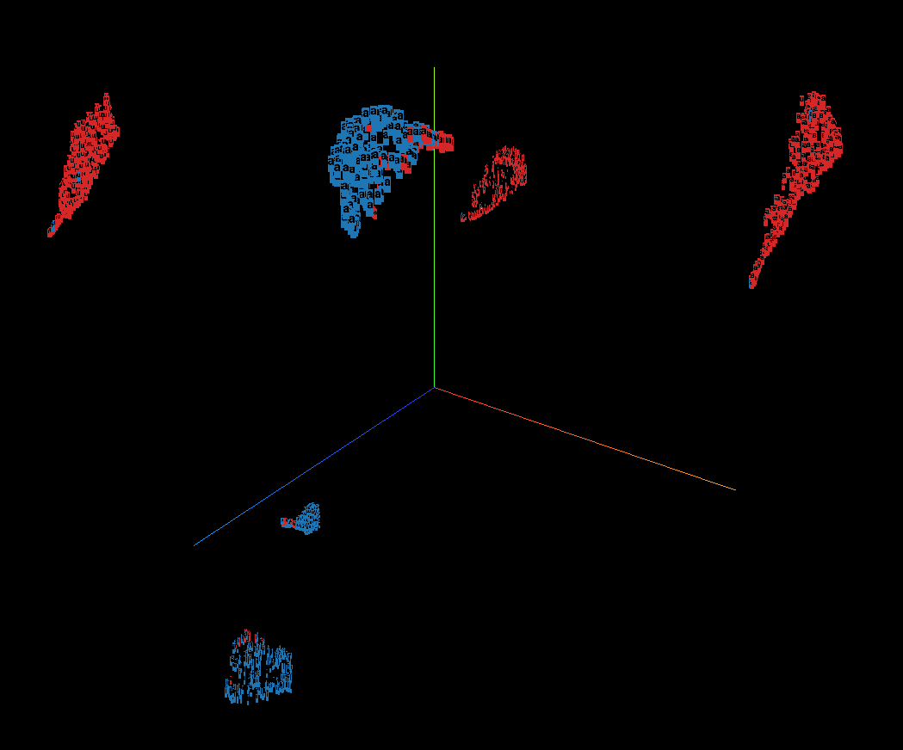

# voxplorer (Alpha v0.0.1)
  

| Table of Contents               |
| ------------------------------- |
| [Installation](#installation)   |
| [Usage](#usage)                 |
| [Useful functions](#useful-functions)         |
| [Future features](#future-features) |
| [Caveats](#caveats)  |
| [Acknowledgements](#acknowledgements)             |  

## Installation
Clone the git repository by running in your preferred terminal emulator:
```sh
git clone https://github.com/delale/voxplorer.git
```

Install [miniconda](https://docs.conda.io/projects/miniconda/en/latest/) or [Anaconda](https://www.anaconda.com/download).  
Open your preferred terminal emulator in the `voxplorer` directory and install the `voxplorer` conda environment:  

**Linux**
```sh
conda env create -f voxplorer_env_Linux.yml
```
:exclamation: This installation has been tested on x86 64-bit Ubuntu only.

**WinOS**
```sh
conda env create -f voxplorer_env_WinOS.yml
```
:exclamation: This installation has not been tested thoroughly yet.

**OSX**
```sh
conda env create -f voxplorer_env_OSX.yml
```
Sometimes an error during the installation of tensorflow and tensorflow-metal may occur in particular with older Intel x86 Macs:
```sh
Pip failed

ERROR: Could not find a version that satisfices the requirement tensorflow-metal (from versions: None)
ERROR: No matching distribution found for tensorflow-metal
```
In this case run the following commands:
```sh
conda activate voxplorer
SYSTEM_VERSION_COMPAT=0 pip install tensorflow tensorflow-metal
```
  
**Verify installation:**
From the voxplorer directory.
```sh
conda activate voxplorer
pytest tests/
```
This should return something like:
```sh
==================== 13 passed, 6 warnings in 25.71s ====================
```
As long as 13 tests are passed, the installation process has been successful.

## Usage
To run the program open a terminal emulator in the voxplorer directory and run 
```sh
conda activate voxplorer
```
To open the voxplorer GUI run:
```sh
python3 voxplorer.py
```
A GUI window should open:  
  
Select your preferred mode... and have fun exploring!

### Visualizer Mode:
With this mode you can visualize in the embedding projector a table of previously extracted features. When selected you will be prompted to select a table; after the table has been selected, the box below will show you a list containing all of the table columns. You can click on each variable that you would like to use as metadata variables. By checking the `Add 'selection' column` checkbox voxplorer will include a `selection` column in the metadata, which by default contains only 0s and can be used to filter the data from within the visualizer. 
> Metadata variables are usually categorical variables used for colouring and labelling in the embedding visualization. Please select all variables that are not to be used as features in the calculation of the reduced dimension space.  
 


### Feature Extraction and Visualization Mode:
With this mode you can extract acoustic features from a set of audio files directly within voxplorer. To do this, all you need to do is select the directory where the audio files (as of now only .WAV files are compatible) are contained.
> The directory can contain also other files (e.g. Praat .TextGrid); voxplorer will simply ignore files that are not audio files.  

> For ease of use, we decided to include the possibility of extracting features from one audio file only (using the `Browse file` button for example). It does not make a lot of sense to project 1 observation, and the projector is unable to visualize only 1 observation at a time, but needs a group of observations to work properly.  

After having selected the input files, you can specify an output directory and filename if you would like to save the extracted features to a table.  
You can then select weather you would like to extract `Speaker embeddings` (ECAPA-TDNN VoxCeleb2 X-vectors) or a set of other acoustic features (`Feature extraction`) by selecting the corresponding radio button.  
If you select `Feature extraction` a box will appear on the bottom of the window (second screenshot below). Here you will find a list of feature-sets available for extraction:  
- Mel features: MFCCs + (optional) delta and delta-delta.
- Acoustic features: pitch descriptors, formants (F1 - F4), vocal tract estimates, HNR, jitter, shimmer, RMS energy.
- Low Lever features: spectral centroid, spectral bandwidth, spectral contrasts (or avg. contrast), spectral flatness, spectral roll-off, zero-crossing rate.
- Linear Predictive Cepstral Coefficients (LPCCs).  
You can select one or multiple of these feature-sets to extract from the audio files. For each selected feature-set a specific window to specify parameter values for that feature-set will appear; please refer to the [demo_Jan2024.pdf](demo/demo_Jan2024.pdf) document for more information regarding the feature-sets and the available parameters.  
Confirm your selection by clicking on `Continue` and a [`Projector`](#project) window will open.  


#### Specifying metadata:
The `Metadata specification` window is used to specify what is the metadata information contained in the filenames of the recordings. `voxplorer` automatically loads a filename and separates its components using the `Separator` character (by default `_`). Changing the `Separator` will automatically update the metadata variables fields with the new separation. You can then specify for each component of the filename what the variable should be named in the embedding visualizer (this will also be saved in the output table if it had been specified). To ignore a variable use `-`. As in the [feature extraction mode](#feature-extraction-and-visualization-mode), you can select `Add 'selection' column` to include a placeholder variable to make selections from within the visualizer.  
  

After having clicked on `Continue` you will be brought back to the `Feature extraction mode` window, where a `Start analysis` button will have appeared. Click this button to begin processing the files.  
When the analysis is finished you will be greeted by a `Features saved` confirmation message and the [`Projector`](#project) window will open.  
  

### Project!
By clicking on `Project!` a new browser tab will open automatically on the embedding projector local webpage.  

To exit you can simply close the browser tab.
> A `Stop projector` button will appear in the `Projector` window, but unfortunately this is as of now not functional.

## Useful functions

### Interactive selection:
In the embedding projector you can then use the several different tools (rectangle selection, selecting by label for e.g. sex, clicking on point and selecting n nearest neighbours) and then on the left tab, navigate to `Edit by` and change the metadata to edit to `selection` (available only if `Add 'selection' columns` was ticked). Change the value to your preferred selection value (e.g. 1). You can then download the edited metadata by clicking on download.

### Filtering mode:
The filtering mode allows you to filer a table by a specific column. This can be done using any table, but is especially useful to finalize the [interactive filtering](#interactive-selection) functionality of voxplorer.  
When selecting this mode you will be prompted with a `Filtering mode` windows. Here you can select a table to filter, a modified metadata TSV table (from voxplorer is using the interactive selection functionality), a join key (variable used to join the original table and the filtered metadata; used only if a modified metadata table has been selected), a selection for the `filtering variable`, and a selection box to indicate the metadata variables (this is used so that these variables are treated as strings and not numbers).  
  

After clicking on `Continue`, you will be prompted to select an output directory and input an output filename. You will also have to input the value you would like to filter for of the previously selected `filtering variable`. By clicking on `Filter` you will be met with a successful filtering message.  
  

### Use JSON dtypes check-box:
When loading any table in voxplorer you will see a check-box labelled `Use JSON dtypes`. This check-box tells voxplorer to look in the same directory as the table for a file with the same name + `_dtypes` and with a JSON extension. This file should contain details for the `Pandas datatype` of each column in the table and is used to ensure that categorical variables are treated as such even in the case of numerical characters. When creating tables using voxplorer (both from the feature extraction and filtering modes), voxplorer will automatically also save this JSON dtypes file.

## Future features:
- [ ] Praat TextGrid support for feature extraction in selected parts of audio (e.g. vowels).  
- [ ] [VoiceSauce](https://phonetics.ucla.edu/voicesauce/) feature extraction.  
- [ ] More feature extraction methods parameters (e.g. formant extraction parameters).
- [ ] Feature extraction (particularly for acoustic features set) visual inspection and confirmetion from user.
- [ ] ECAPA-TDNN speaker verification:
  - pairwise speaker comparisons + distance and similarity scores output
  - selective speaker comparisons

## Beta v1.0 project:
- [ ] Moving away from TensorBoard embedding projector to interactive web-app using `plotly-dash` and `bokeh`.
- [ ] Statistical tools.
- [ ] Online access to tool.

## Caveats
- Data that contains NAs: a Warning will be raised and the rows containing NA values will be removed (otherwise TensorBoard will raise an error where it is unable to transorm str to float64).
- `Close projector` button does not work currently.
- Single observations are not visualized in embedding projector.

## Acknowledgements
This work is supported by the Linguistic Research Infrastracture [LiRI](https://liri.uzh.ch) and is a supporting project to my doctorate at the [Department of Computational Linguistics](https://cl.uzh.ch) of the University of Zurich.

The project is looking for collaborators, so if you would be interested, feel free to drop me a message.